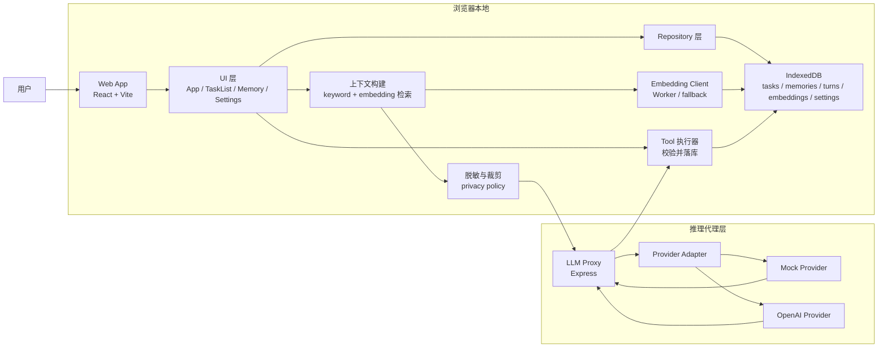
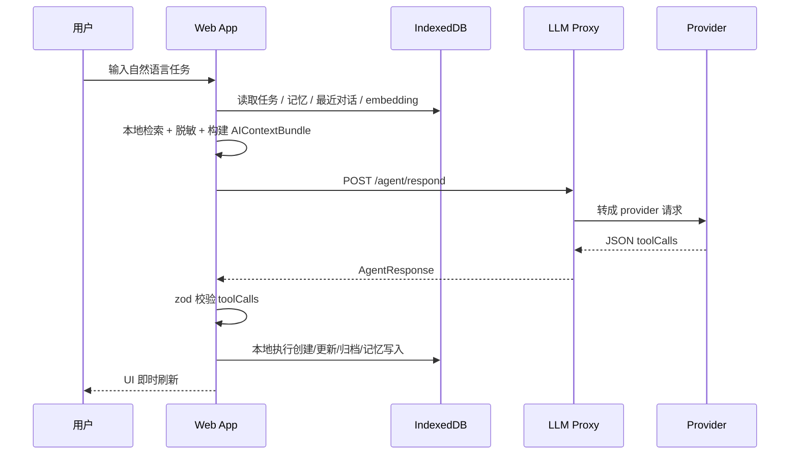

# AI TODO

一个本地优先的 AI 任务管理实验项目。

它不是“把 Chat 接到 Todo 列表上”这么简单，而是把任务系统、长期记忆、检索、策略化规划、远端推理代理拆成了几个清晰的层，让 AI 真正参与“整理事务”这件事，同时尽量把用户数据留在本地。

## 项目目标

这个项目想解决的问题是：

- 用户习惯用自然语言描述任务，而不是先手动拆成结构化字段。
- 普通 Todo 工具能存任务，但不擅长根据上下文帮你拆解、归类和提炼下一步。
- 直接把全部任务和笔记发送给远端模型，会带来隐私和 payload 失控问题。

因此，这个项目采用了下面这套思路：

1. 用户继续用自然语言输入。
2. 前端先在本地做检索，挑出最相关的任务、记忆、最近对话。
3. 在发送前做显式脱敏和裁剪，只上传“足够推理”的上下文切片。
4. 远端模型只返回结构化 `toolCalls`，不直接改数据库。
5. 前端验证 `toolCalls` 后，在本地 IndexedDB 执行真正的数据变更。

一句话概括：

> AI 负责理解和建议，本地前端负责状态真相与执行落库。

## 核心原理

### 1. Local-first

任务、记忆、嵌入向量、设置都保存在浏览器本地 IndexedDB 中。即使远端模型不可用，用户仍然可以查看和编辑自己的任务数据。

### 2. Retrieval-first，而不是全量上传

用户每次发消息时，前端不会把整个数据库打包发出去，而是本地先做两轮检索：

- 关键词检索
- embedding 相似度检索

然后只取少量相关任务、相关记忆和最近对话，构成 `AIContextBundle`。

### 3. Privacy-first

上下文在发送前会经过隐私过滤层：

- 任务备注只发送短摘录
- 标签数量受限
- 邮箱、手机号、链接、疑似 token、长数字串会被掩码
- 记忆只发送脱敏后的 summary
- 原始 `sourceTurnIds`、完整本地记录不会离开浏览器

### 4. Tool-call execution

模型返回的不是“自由文本指令”，而是结构化操作：

- `batch_create_tasks`
- `update_tasks`
- `archive_tasks`
- `upsert_memory`
- `set_strategy`

这些返回值会先经过 `zod` schema 校验，再由前端在本地执行。

### 5. Strategy-aware planning

这个项目不是单一看板，而是内置了三种策略插件：

- `GTD`
- `Eisenhower`
- `Deep Work`

策略会同时影响：

- 看板列定义
- 提示词语气
- 检索强调点
- 新任务的默认归类

也就是说，策略不是单纯换个 UI 皮肤，而是会改变 AI 理解任务的方式。

## 产品架构

### 总体架构图



### 启动与控制流



## 代码结构

这是一个 `pnpm workspace` Monorepo。

### 1. `apps/web`

前端应用，是真正的产品核心。

职责可以按下面几个模块理解：

- 启动层
  - `src/main.tsx`
  - 挂载 React 应用
- 编排层
  - `src/App.tsx`
  - 负责把 UI、数据库、策略、检索、远端调用、tool 执行串起来
- UI 层
  - `src/components/*`
  - 包含聊天输入、任务列表、记忆面板、设置面板、策略切换等
- 数据层
  - `src/db/database.ts`
  - 定义 Dexie / IndexedDB 表
  - `src/db/repositories.ts`
  - 封装任务、记忆、对话、设置、embedding 的 CRUD
- Agent 层
  - `src/agent/context.ts`
  - 本地检索并构建发送给模型的上下文
  - `src/agent/api.ts`
  - 调用远端 proxy
  - `src/agent/tools.ts`
  - 执行模型返回的工具调用
  - `src/agent/embedding.ts`
  - 浏览器侧 embedding 客户端，优先 worker，超时走 fallback
- 策略层
  - `src/strategies/index.ts`
  - 定义 GTD / 艾森豪威尔 / 深度工作的行为差异

### 2. `apps/llm-proxy`

一个轻量、无状态的代理层。

它的目标不是保存业务数据，而是：

- 接收前端发送的 `AIContextBundle`
- 做 schema 校验
- 选择 provider adapter
- 调用模型
- 返回结构化 `AgentResponse`

当前 provider 结构已经拆分为 adapter：

- `providers/mock.ts`
- `providers/openai.ts`
- `providers/prompt.ts`

这意味着以后加 Anthropic 或 OpenAI-compatible 本地模型时，不需要重写主路由。

### 3. `packages/contracts`

共享的协议定义层。

这里定义了：

- Task / Memory / Turn 数据结构
- AIContextBundle
- PrivacyPolicy
- ToolCall schema
- AgentResponse schema
- Strategy schema

它的作用是保证前端、代理、测试对同一份协议说话。

## 数据模型

浏览器本地 IndexedDB 目前主要包含这几类数据：

- `tasks`
  - 用户任务主表
- `conversation_turns`
  - 最近对话
- `memories`
  - 长期记忆 / 短期记忆
- `embeddings`
  - 任务与记忆的向量表示
- `settings`
  - 当前策略、代理地址等本地设置

其中有一个很关键的设计：

- `tasks` / `memories` 是业务真相
- `embeddings` 是检索加速层

也就是说，embedding 不是主数据，只是为了提高召回效果的派生索引。

## 一次请求是怎么工作的

以“帮我把展会项目拆成下一步行动”为例：

1. 用户在前端输入一句自然语言。
2. 前端把这句话保存为一条用户对话。
3. 前端在本地做检索：
   - 最近对话
   - 关键词相关任务
   - 关键词相关记忆
   - embedding 相似任务
   - embedding 相似记忆
4. 前端对检索结果做脱敏和裁剪。
5. 前端把 `AIContextBundle` 发送到 `/agent/respond`。
6. proxy 把上下文转成 provider prompt。
7. provider 返回 JSON 格式的 `message + toolCalls`。
8. 前端校验这些 toolCalls。
9. 前端执行本地更新：
   - 创建任务
   - 更新任务
   - 归档任务
   - 写入记忆
   - 切换策略
10. UI 自动刷新，并重新生成 embedding 索引。

## 为什么要分前端执行和远端推理

这是这个项目最重要的架构决策之一。

如果让模型直接“拥有数据库写权限”，会出现几个问题：

- 难以约束写入格式
- 难以验证行为
- 容易产生不可逆的脏数据
- 不利于做本地优先与离线编辑

所以这里选择：

- 模型只负责“建议动作”
- 前端只接受有限的结构化工具集合
- 所有真正的数据修改都在本地、可验证、可测试的代码里完成

这让系统更像：

- 远端模型 = planner
- 本地前端 = executor

## 当前能力

目前已经可以做到：

- 自然语言捕获任务
- 本地保存任务、记忆、设置
- 任务直接编辑
  - 状态
  - 优先级
  - 看板列
  - 截止日期
  - 备注
  - 归档
- 记忆整理
  - 提高权重
  - 降低权重
  - 删除
- 策略切换
  - GTD
  - 艾森豪威尔
  - 深度工作
- 脱敏后远端推理
- Mock / OpenAI provider 切换

## MVP 边界

当前版本是一个本地优先 MVP，还没有覆盖这些能力：

- 多设备同步
- 云端账号体系
- 推送通知 / 提醒
- 日历联动
- CLI 入口
- 自动化定时任务
- 导入导出
- 真正完整的 focus session 管理

## 如何运行

### 环境要求

- Node.js 20+
- pnpm 10+

### 安装依赖

```bash
pnpm install
```

### 启动前端和代理

先启动代理：

```bash
pnpm dev:proxy
```

再启动前端：

```bash
pnpm dev:web
```

默认情况下：

- 前端地址通常是 `http://localhost:5173`
- 前端默认把请求发到同源 `/api`
- 开发环境会把 `/api` 反向代理到 `http://localhost:8787`
- 生产环境需要在 nginx / CDN 层面配置 `/api` → 后端的反向代理
- provider 默认是 `mock`

### 使用 OpenAI

在仓库根目录或 `apps/llm-proxy` 下创建 `.env`：

```bash
LLM_PROVIDER=openai
OPENAI_API_KEY=your_key
OPENAI_MODEL=gpt-4.1-mini
PORT=8787
```

如果没有配置 `OPENAI_API_KEY`，系统会自动回退到 `mock` provider。

### 使用火山引擎（豆包）

在仓库根目录或 `apps/llm-proxy` 下创建 `.env`：

```bash
LLM_PROVIDER=volcengine
ARK_API_KEY=your_key
ARK_MODEL=doubao-1.5-pro-256k-250115
PORT=8787
```

- `ARK_API_KEY`：在 [火山方舟控制台](https://console.volcengine.com/ark) 获取
- `ARK_MODEL`：模型名称或推理接入点 ID（ep-xxx 格式均可）
- 可选 `ARK_BASE_URL` 覆盖默认的 `https://ark.cn-beijing.volces.com/api/v3`

如果没有配置 `ARK_API_KEY`，系统会自动回退到 `mock` provider。

## 使用方式

### 1. 录入任务

直接在输入框里写自然语言，例如：

- `帮我把下周展会项目拆成下一步行动`
- `提醒我处理报销`
- `这周要把演示文稿和 booth 物料准备好`

### 2. 切换策略

可以切到不同策略模式：

- `GTD`
  - 适合清空脑负担、澄清下一步动作
- `艾森豪威尔`
  - 适合按重要/紧急排序
- `深度工作`
  - 适合突出高价值任务，压低浅层事务噪音

### 3. 直接编辑任务

在任务列表中可以直接修改：

- 状态
- 优先级
- 所属列
- 截止日期
- 备注

这些修改会立即写入本地数据库，并在需要时更新 embedding 索引。

### 4. 整理记忆

在记忆面板中可以：

- 提高权重
- 降低权重
- 删除不合适的记忆

这会直接影响之后的检索质量。

### 5. 修改代理地址

在设置面板中可以修改 `Agent Proxy Endpoint`，方便把前端指向不同的推理代理，而不需要改源码。

## 测试与构建

### 单元测试

```bash
pnpm test
```

### E2E 测试

```bash
pnpm test:e2e
```

### 构建全部包

```bash
pnpm build
```

## 适合继续扩展的方向

如果你准备继续做这个项目，当前最适合扩展的点有：

- 增加更多 provider adapter
- 增加导入导出
- 强化 strategy 对 tool policy 的约束
- 做真正可运行的 Deep Work 专注计时
- 提升 embedding 初始化状态提示
- 增加同步层，但保持本地优先架构不被破坏

## 总结

这个项目的核心不是“AI 生成任务”，而是构建了一个清晰的任务操作闭环：

- 输入是自然语言
- 检索在本地
- 隐私过滤在前端
- 推理在远端模型
- 执行在本地数据库
- 结果通过策略化 UI 呈现

如果把它当成一个产品原型来看，它已经具备了一个 AI Todo 系统最关键的几个能力：

- 可解释的数据流
- 可验证的执行边界
- 可扩展的 provider 结构
- 可演进的策略插件体系
- 可控的隐私模型
